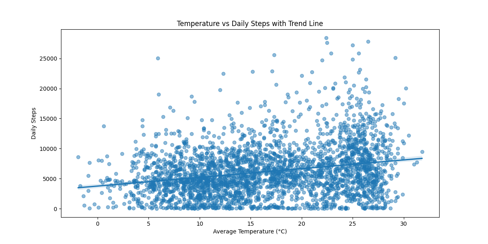
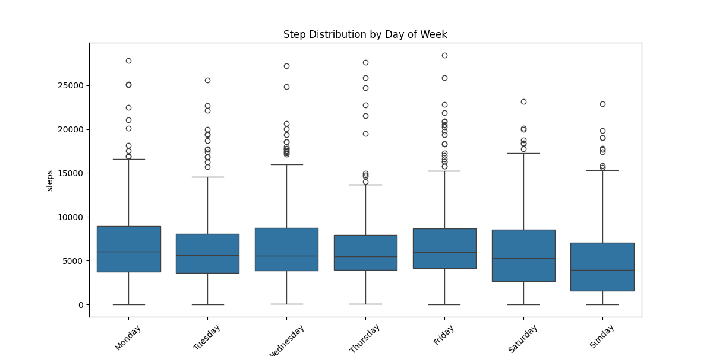
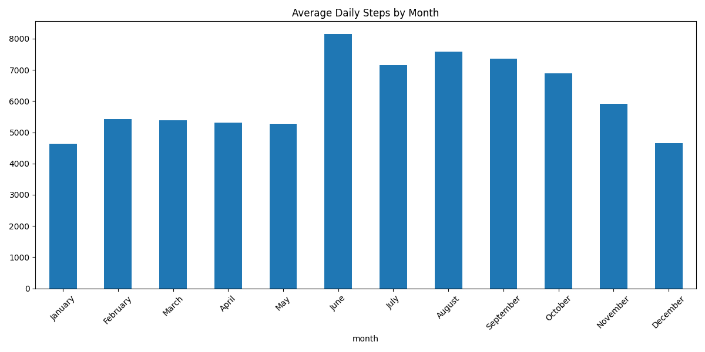
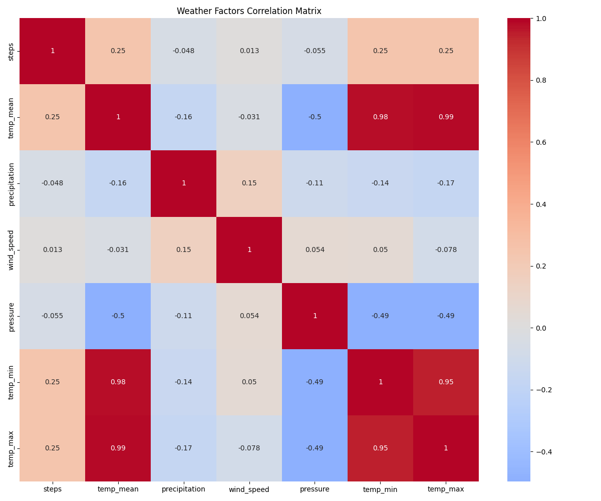
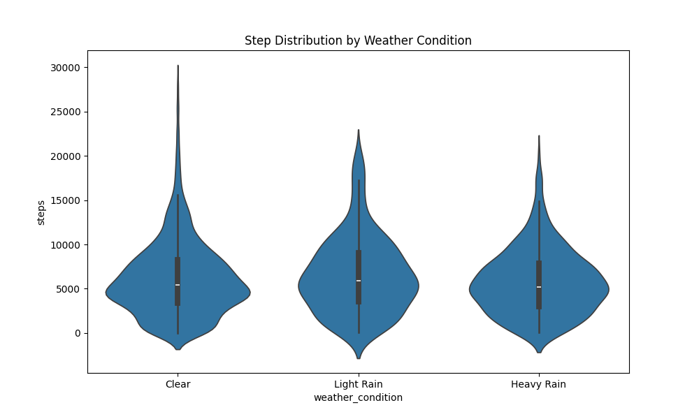
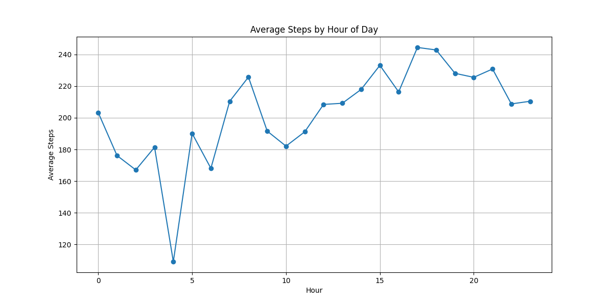
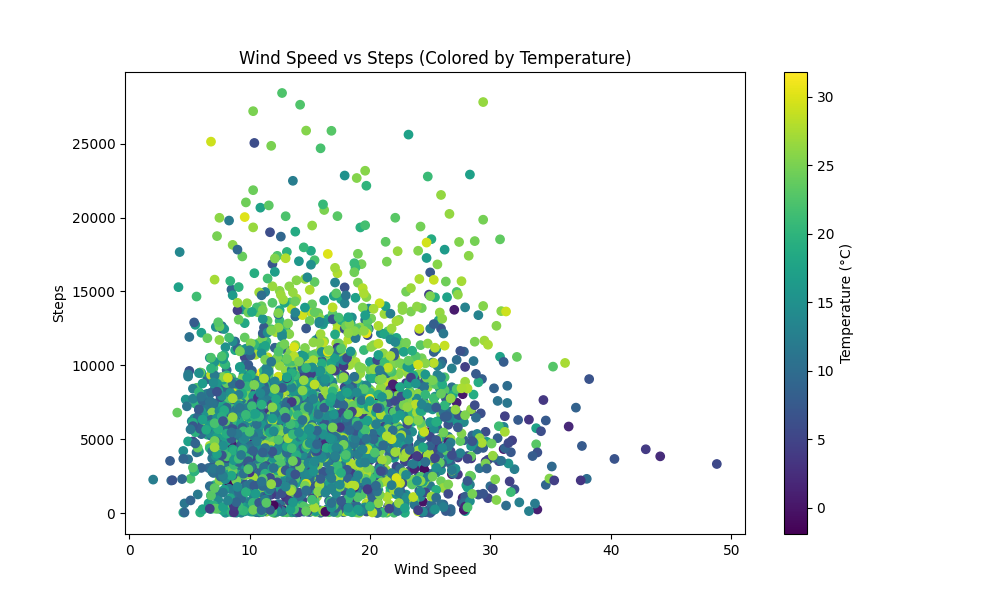
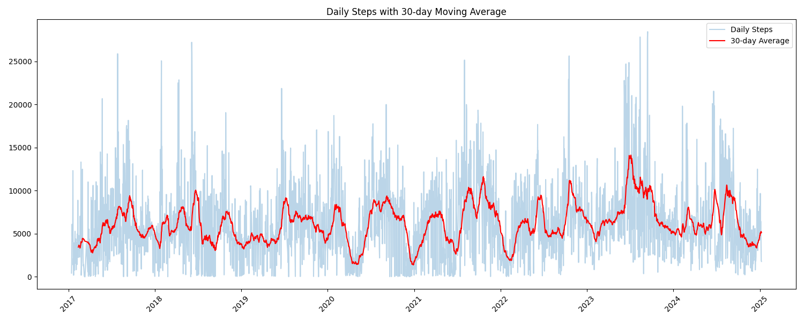
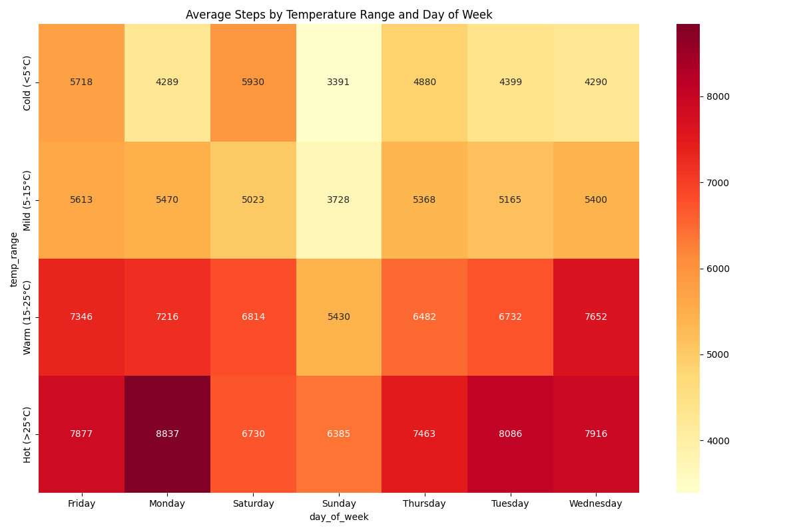

# Walking Patterns Analysis Based on Weather Conditions

## Quick Links
- [Step Data (CSV)](data/step_data.csv)
- [Weather Data (CSV)](data/weather_data.csv)
- [Raw Health Export (XML)](export.xml)

## Motivation
This project emerged from a personal interest in understanding how environmental factors influence daily physical activity. As someone who regularly walks in Istanbul, I wanted to analyze:
1. The impact of weather on my walking habits
2. Patterns that could help optimize daily activity
3. The relationship between seasonal changes and movement
4. How to maintain consistent activity despite weather variations

## Project Structure
walking-patterns-analysis/
  * data/
    + step_data.csv     # Processed step count data
    + weather_data.csv  # Historical weather data
  * src/
    + date_extractor.py # Extracts step data from export.xml
    + weather_fetcher.py # Fetches historical weather data
    + data_analyzer.py  # Analyzes data and generates plots
  * output/
    + plots/           # Generated visualization plots
      - temperature_vs_steps.png
      - daily_steps.png
      - ...
    + analysis.txt     # Detailed analysis findings
  * export.xml          # Raw Apple Health export data
  * README.md          # Project documentation

## Executive Summary
This analysis explores the relationship between weather conditions and walking habits using data collected from Apple Health app and historical weather records from Istanbul, Turkey. The study spans multiple years and reveals significant patterns in how weather influences daily step counts.

## Research Question
**How do different weather conditions influence walking behavior and habits?**

## Data Collection & Methodology

### Data Sources
1. **Walking Data**: 
   - Source: Apple Health app export (XML format)
   - Period: Multiple years of daily step counts
   - Metrics: Steps, duration, and timestamps

2. **Weather Data**: 
   - Source: Meteostat API
   - Location: Istanbul (41.0082°N, 28.9784°E)
   - Metrics: Temperature, precipitation, wind speed, pressure

### Data Processing Pipeline
1. **Step Data Extraction** (`date_extractor.py`):
   - Parsed XML health data
   - Aggregated steps by date
   - Calculated daily statistics

2. **Weather Data Collection** (`weather_fetcher.py`):
   - Retrieved historical weather data
   - Matched weather conditions with step dates
   - Handled missing values with forward/backward fill

3. **Data Analysis** (`data_analyzer.py`):
   - Merged step and weather data
   - Generated visualizations
   - Calculated correlations and statistics

## Key Findings

### 1. Overall Statistics
- Total days analyzed: 2,893
- Average daily steps: 6,148
- Highest recorded: 28,430 steps
- Lowest recorded: 1 step

### 2. Temperature Impact


Temperature shows a positive correlation with step count:
- Cold (<5°C): 4,678 steps/day
- Mild (5-15°C): 5,112 steps/day
- Warm (15-25°C): 6,811 steps/day
- Hot (>25°C): 7,610 steps/day

### 3. Daily Patterns


Average steps by weekday:
- Highest: Monday (6,652 steps)
- Lowest: Sunday (4,813 steps)
- Weekdays generally show higher activity

### 4. Seasonal Trends


Monthly averages show clear seasonal patterns:
- Peak months: June (8,149 steps)
- Lowest months: January (4,637 steps)
- Summer months consistently show higher activity

### 5. Weather Correlations


Correlation with daily steps:
- Temperature: +0.250 (strongest positive correlation)
- Precipitation: -0.048 (slight negative)
- Wind speed: +0.013 (negligible)
- Pressure: -0.055 (slight negative)

### 6. Weather Conditions Impact


Average steps by weather:
- Light Rain: 6,564 steps
- Clear: 6,167 steps
- Heavy Rain: 5,783 steps

### 7. Daily Activity Patterns


The analysis of hourly patterns reveals peak walking times and daily routines.

### 8. Wind and Temperature Effects


Combined analysis of wind speed and temperature shows their joint impact on walking behavior.

### 9. Long-term Trends


30-day moving average reveals long-term patterns and seasonal variations.

### 10. Temperature-Day Relationship


Heat map showing the combined effect of temperature ranges and days of the week.

## Notable Records

### Top Walking Days
1. 2023-09-15: 28,430 steps (22.4°C, Clear)
2. 2023-08-14: 27,817 steps (26.5°C, Clear)
3. 2023-09-14: 27,635 steps (22.5°C, Clear)
4. 2018-06-06: 27,200 steps (25.0°C, Clear)
5. 2018-06-07: 25,885 steps (25.6°C, Clear)

## Conclusions & Recommendations

### Key Findings
1. **Temperature Impact**: Warmer temperatures (>25°C) correlate with significantly higher step counts
2. **Weekly Patterns**: Mondays show highest activity, Sundays lowest
3. **Seasonal Variation**: Summer months (June-August) show peak activity
4. **Weather Resilience**: Light rain doesn't significantly deter walking

### Optimal Walking Conditions
- Temperature: Warm to hot (>15°C)
- Day of Week: Monday-Friday
- Season: Summer months
- Weather: Light rain or clear conditions

### Recommendations
1. **Winter Strategy**: Compensate for reduced winter activity with indoor alternatives
2. **Weekend Activity**: Focus on increasing weekend step counts
3. **Weather Adaptation**: Don't let light rain deter walking activities
4. **Time Management**: Plan walks during optimal temperature periods

## Technical Implementation
The complete code and data processing pipeline is available in the repository:
- `src/date_extractor.py`: Step data processing
- `src/weather_fetcher.py`: Weather data collection
- `src/data_analyzer.py`: Analysis and visualization

## Technologies Used
- Python (pandas, matplotlib, seaborn)
- Meteostat API
- XML processing
- Data visualization tools

## Usage
1. **Setup**
   ```bash
   # Clone the repository
   git clone https://github.com/yourusername/walking-patterns-analysis
   cd walking-patterns-analysis

   # Install required packages
   pip install -r requirements.txt
   ```

2. **Data Processing**
   ```bash
   # Extract step data from Apple Health export
   python src/date_extractor.py

   # Fetch weather data
   python src/weather_fetcher.py

   # Run analysis and generate visualizations
   python src/data_analyzer.py
   ```

3. **View Results**
   - Check `output/plots/` for visualizations
   - See `output/detailed_insights.txt` for detailed analysis
   - Review this README for comprehensive findings

## Data Sources

### Apple Health Data
- **Format**: XML export from Apple Health app
- **Period**: Multiple years (2017-2024)
- **Collection Method**: Automatic step counting via iPhone
- **Key Metrics**:
  - Step counts
  - Timestamps
  - Duration of activity
  - Source (iPhone/Watch)

### Weather Data (Meteostat)
- **API**: Meteostat Historical Weather API
- **Location**: Istanbul, Turkey (41.0082°N, 28.9784°E)
- **Period**: Matching step data timeline
- **Parameters**:
  - Temperature (mean, min, max)
  - Precipitation
  - Wind speed and direction
  - Atmospheric pressure
  - Snow depth
  - Sunshine hours

